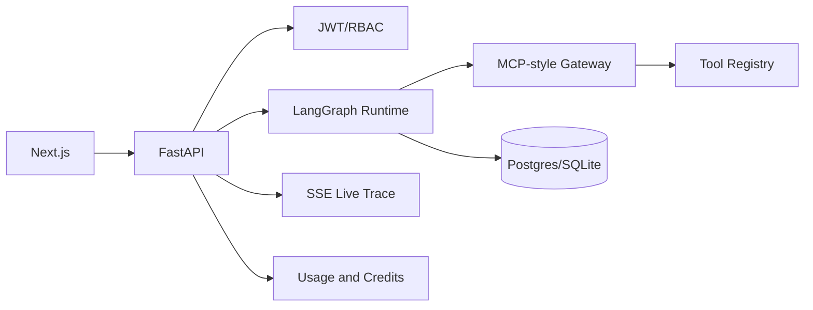

# TaskFlow AI

TaskFlow AI is a flagship-level MVP for AI Agent workflow automation: designing, running, approving, monitoring, and auditing multi-step AI workflows.

It currently demonstrates executable workflows, tool calling, approval pause/resume, live trace, usage logs, credit deduction, replay, and an AgentOps dashboard. Alembic migrations and a Docker Celery/Redis path exist. The frontend is deployed on Vercel; the permanent Render + managed PostgreSQL backend is one dashboard step away via the blueprint below.

## Live Demo

- Frontend: https://taskflow-ai-seven-eosin.vercel.app
- Try Guest Demo from the homepage (uses `demo-local` AI and seeded research data).
- Permanent API: deploy the backend with Render (managed PostgreSQL included):

[](https://render.com/deploy?repo=https://github.com/Shifu710/taskflow-ai)

After Render is live, set Vercel `NEXT_PUBLIC_API_BASE_URL` to `https://<your-render-service>/api/v1` and redeploy.

## Demo Accounts

- Guest: `guest@taskflow.ai` / `guest123`
- Demo owner: `demo@taskflow.ai` / `demo12345`

The **Try Guest Demo** button signs in automatically. No private AI provider keys are required.

## Tech Stack

| Area | Stack |
|---|---|
| Frontend | Next.js App Router, TypeScript, Tailwind CSS, React Flow, Recharts |
| Backend | FastAPI, Python, Pydantic, SQLAlchemy 2.x |
| Runtime | LangGraph state graph, ModelGateway demo-local fallback |
| Tools | Tool registry, JSON schema validation, MCP-style gateway |
| Observability | SSE live trace, usage logs, tool logs, credit transactions, Langfuse-ready config |
| Deployment | Docker Compose, Vercel-ready frontend, hosted FastAPI-ready backend, PostgreSQL-ready data layer |

## Real vs Demo Scope

- Real in the MVP: workflow runs, persisted run steps, MCP-style internal gateway, executable demo tools, approval pause/resume, SSE trace, tool logs, usage logs, credit deduction, replay, and RBAC checks.
- Demo-local by design: AI model responses use `demo-local` when provider keys are missing.
- Seeded data: `demo_search` uses seeded demo search data, not live web search.
- Simulated writes: external write tools such as webhook sending, CRM notes, and task creation are simulated in public demo mode.
- Gateway scope: the project implements an MCP-style internal gateway, not a full external MCP server/client.
- Database scope: SQLite is a quick-demo mode; PostgreSQL plus Alembic migrations are the production data path.
- Still upgrading: permanent Render backend + managed PostgreSQL (blueprint ready), active scheduled trigger execution, and real Langfuse trace sending.

## Architecture



## Runtime Flow

`planner -> demo_search -> company_profile_lookup -> approval_gate -> outreach_writer -> reviewer -> formatter`

The run pauses at the approval gate, stores a pending approval, resumes after approval, validates the final structured report, deducts credits, and writes usage logs.

## Local Setup

```bash
npm install
pip install -r services/api/requirements.txt
uvicorn app.main:app --reload --app-dir services/api
npm run dev --workspace apps/web
```

Open `http://localhost:3000`.

## Docker Setup

```bash
docker compose up --build
```

Docker Compose starts PostgreSQL, Redis, FastAPI, the Celery worker, and the Next.js frontend. Local non-Docker development keeps synchronous execution by default with `TASKFLOW_USE_CELERY=false`, so the guest demo remains easy to run without a worker.

## Database Migrations

SQLite remains available for quick local demo mode, but PostgreSQL plus Alembic is the production data path.

```bash
cd services/api
alembic upgrade head
```

## Environment Variables

Copy `.env.example` and set provider keys only on the backend. Missing AI keys use honest `demo-local` responses.

For a deployed frontend/backend split, set:

```bash
NEXT_PUBLIC_API_BASE_URL=https://<backend-domain>/api/v1
FRONTEND_ORIGINS=https://<frontend-domain>
```

## Testing

```bash
pytest services/api/app/tests
npm run typecheck --workspace apps/web
npm run lint --workspace apps/web
npm run build --workspace apps/web
```

## Known Limitations

- Public demo uses seeded company/product data, not live web search.
- External writes such as webhook sending, CRM notes, and task creation are simulated in demo mode.
- Celery/Redis worker mode is wired for Docker deployments. Local quick-demo mode executes synchronously unless `TASKFLOW_USE_CELERY=true`.
- Langfuse is configuration-ready but does not send external traces until the optional tracing phase is implemented.
- Vercel frontend is live; managed PostgreSQL on Render is pending one-time blueprint apply (see Live Demo).
- Scheduled triggers are schema/API-level and are not an active production scheduler yet.

## Chinese Summary

TaskFlow AI 是一个企业级 AI Agent 工作流自动化平台，支持 LangGraph 状态机、工具调用、MCP 风格工具集成、人审节点、实时执行轨迹、失败重试、成本控制、Webhook/定时触发和 AgentOps 可观测性。
