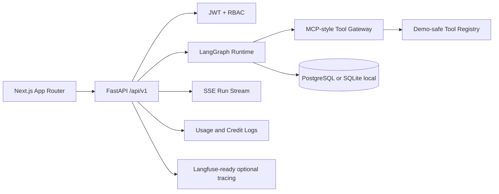

# TaskFlow AI Architecture

TaskFlow AI is an enterprise AI Agent workflow automation platform. The frontend is a Next.js App Router app. The backend is FastAPI with SQLAlchemy models for workspaces, RBAC, workflows, tools, runs, approvals, usage, credits, triggers, and webhook events.

The public demo target is `demo-local` model responses with seeded business data. Runtime state, approvals, tool calls, usage logs, and credit transactions persist through SQLAlchemy. SQLite is the quick-demo path; PostgreSQL with Alembic is the intended production data path.

Deployment status: Vercel frontend is live at https://taskflow-ai-seven-eosin.vercel.app. End-to-end public QA passed on the frontend with an interim API tunnel during deployment work. Permanent hosting uses `render.yaml` (FastAPI Docker + Render managed PostgreSQL). Apply the Render blueprint, then point `NEXT_PUBLIC_API_BASE_URL` at `https://<render-service>/api/v1`.
